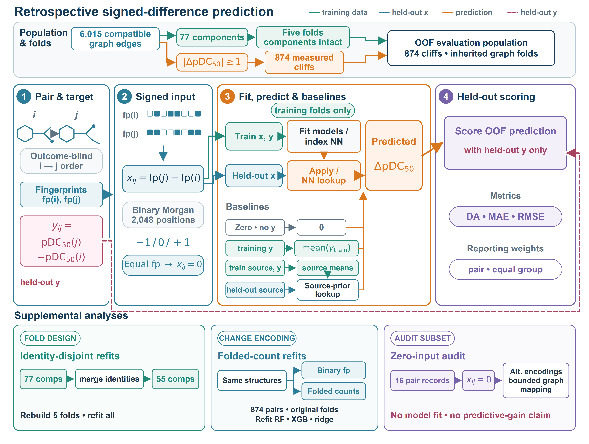

# Predicting signed pDC50 differences in PROTAC activity-cliff pairs: a retrospective comparison of machine-learning models

This repository provides data-reconstruction, fixed-recipe model-fitting, and result-recomputation code for a retrospective comparison of signed pDC50 differences within **874 measured PROTAC activity-cliff pairs from 420 records**. It includes author-generated predictions and resampling plans, aggregate results, and manuscript figures. Molecular structures and measured activities are obtained from the fixed public source using the supplied download script.

The six-contrast family was fixed after early findings from the same data; its multiplicity-adjusted percentile intervals have uncalibrated coverage. The [reproduction coverage](docs/reproduction.md) distinguishes the runnable TACK-based analyses from historical source diagnostics that still need additional materials.

The task begins after both endpoint activities are known and a pair meets the operational cliff definition. It evaluates local signed-difference resolution; it does not evaluate prospective cliff discovery, compound ranking, target-held-out deployment, or mechanism prediction.

## Main findings

The primary family compares XGBoost with random forest under pair weighting and equal comparison-group weighting. Direction accuracy uses XGBoost minus random forest; MAE and RMSE use random forest minus XGBoost. Positive values therefore favor XGBoost in every row.

| Weighting | Metric | Contrast | Multiplicity-adjusted interval |
| --- | --- | ---: | ---: |
| Pair | Direction accuracy | 0.032 | [-0.043, 0.098] |
| Pair | MAE | 0.140 | [0.006, 0.330] |
| Pair | RMSE | 0.040 | [-0.107, 0.172] |
| Equal comparison group | Direction accuracy | 0.025 | [-0.044, 0.093] |
| Equal comparison group | MAE | 0.137 | [0.005, 0.336] |
| Equal comparison group | RMSE | 0.039 | [-0.107, 0.190] |

Only the two MAE intervals have positive lower bounds under the sealed 77-component, B = 2,000 analysis. All six post hoc 17-target intervals include zero. That sensitivity changes the resampling unit, sampling universe, and replicate count together, so it does not isolate target clustering as the cause of the interval change.

The two supplemental families are also bounded. All six global identity-disjoint XGBoost-versus-random-forest intervals include zero. Folded counts distinguish 14 of the 16 binary-fingerprint-equal pair records. In the separate 874-pair prediction comparison, all 18 count-versus-binary intervals include zero. XGBoost has worse point estimates on all three metrics under both weighting schemes. Zero-spanning intervals do not establish equivalence.

Full-precision values, support counts, and interpretation notes are in [results](results/).

## Repository map

| Path | Contents |
| --- | --- |
| [scripts/reproduce.py](scripts/reproduce.py) | Reconstructs the fixed data and runs the declared analyses, using cached predictions or refitting the 575 models. |
| [scripts/fetch_source.py](scripts/fetch_source.py) | Downloads and verifies the fixed public TACK source. |
| [reproduction](reproduction/) | Author predictions without source activities or structures, and saved resampling plans. |
| [scripts/run_synthetic_demo.py](scripts/run_synthetic_demo.py) | Deterministic offline toy workflow for checking local dependencies and shared aggregation code. |
| [scripts/recompute_primary_component_metrics.py](scripts/recompute_primary_component_metrics.py) | Rescores frozen primary predictions with the saved 2,000 × 77 component plan. |
| [scripts/run_supplemental_e1.py](scripts/run_supplemental_e1.py) | Rescores frozen E1 identity-disjoint predictions with the saved 2,000 × 55 component plan. |
| [scripts/run_supplemental_e2.py](scripts/run_supplemental_e2.py) | Rescores paired folded-count and binary predictions with the saved 50,000 × 77 component plan. |
| [results](results/) | Checked-in aggregate tables at stored precision. |
| [figures](figures/) | Figures 1–5 and Figure S1 in reviewable formats. |
| [docs](docs/) | Reproduction guide, exact input contracts, data-access boundary, and licensing status. |

Figure 6 is not included because it contains molecular structures and record identifiers whose redistribution status has not been cleared.

## Reproduce the reported comparisons

Use Python 3.11 in a dedicated environment. The fitting and reconstruction dependencies are pinned separately from the lightweight rescoring dependencies:

~~~bash
python -m pip install -r environment/primary-requirements.txt
python scripts/reproduce.py --mode cached --output-dir ../protac-reproduction-cached
~~~

This downloads the fixed TACK snapshot, reconstructs records, pairs, folds, fingerprints and targets, and recomputes the primary, E1, E2 and supported-target contrasts from the released predictions. It also runs the identity-recurrence, Morgan-representation and bounded structure audits, together with the reported post hoc component extension. The final check compares 36 contrast estimates and interval endpoints, extension prefixes and MCSE with the reported tables.

To rerun the original 200 primary fits and the 375 supplemental fits before scoring:

~~~bash
python scripts/reproduce.py --mode refit --output-dir ../protac-reproduction-refit
~~~

Use a new output directory for each run. An existing fixed TACK download can be supplied with `--source-file <parquet>`. These commands do not reconstruct the historical PROTAC-DB nonself anchors or unpreserved upstream provenance. Exact coverage and output locations are in the [reproduction guide](docs/reproduction.md).

## Lightweight installation

Use Python 3.11 or newer in an isolated environment. On Windows PowerShell:

~~~bash
py -3.11 -m venv .venv
.\.venv\Scripts\python.exe -m pip install -r requirements.txt
~~~

On POSIX shells:

~~~bash
python3.11 -m venv .venv
.venv/bin/python -m pip install -r requirements.txt
~~~

The manuscript records separate original study environments for model fitting and RDKit-based structure analyses. Installing this repository's lightweight requirements does not recreate those environments or rerun model training.

In the commands below, `python` means the interpreter inside that environment: `.\.venv\Scripts\python.exe` on Windows or `.venv/bin/python` on POSIX.

## Run the offline synthetic demo

~~~bash
python scripts/run_synthetic_demo.py --output-dir demo_output
~~~

The demo generates deterministic toy inputs and exercises the shared aggregation, weighting, within-seed RMSE, and count/binary pairing code without downloading data. A successful run checks this toy software path. It does not run the fixed-study input contract.

**The demo is not a scientific reproduction.** It does not use the 874 study pairs, rebuild the dataset, construct the reported folds, train a model, recreate frozen predictions, or reproduce a manuscript result.

## Run an individual recomputation

The unified command prepares inputs automatically. Each statistical stage is also available separately:

~~~bash
python scripts/recompute_primary_component_metrics.py --predictions <csv> --draw-plan <npz-or-csv> --output-dir <dir>
python scripts/run_supplemental_e1.py --predictions <csv> --draw-plan <npz-or-csv> --output-dir <dir>
python scripts/run_supplemental_e2.py --count-predictions <csv> --binary-predictions <csv> --draw-plan <npz-or-csv> --output-dir <dir>
~~~

These individual commands consume analysis-ready tables; reconstruction and fitting are separate stages in `reproduce.py`. See [input contracts](docs/input_contracts.md) for required columns, aggregation order, and output schemas.

## Additional bounded analyses

Three specialized tools remain available for narrower retained analyses:

| Tool | Boundary |
| --- | --- |
| [evaluate_predictions.py](scripts/evaluate_predictions.py) | Recomputes fixed-prediction point metrics and contrasts and can replay the separate saved 17-target plan. It does not reproduce the primary component plan or fit models. |
| [identity_sensitivity.py](scripts/identity_sensitivity.py) | Filters frozen OOF predictions into identity-recurrence and recorded-assay subsets without refitting or changing folds. |
| [representation_audit.py](scripts/representation_audit.py) | Regenerates the bounded 16-pair binary/sparse Morgan audit from authorized structures. It does not train a model or test predictive gain and requires the separate RDKit environment. |

Their commands and schemas are documented in [fixed-prediction evaluation](docs/evaluation.md), [identity sensitivity](docs/identity_sensitivity.md), and [representation audit](docs/representation_audit.md).

## Data and reproduction boundary

The study used a locally frozen 4,184-row TACK DC50 snapshot. A currently accessible fixed revision was later verified to match the retained bytes. That fixed commit is a recovery anchor; it does not identify the unknown revision or authoritative retrieval time of the original download, nor does it recover upstream row-level provenance.

Source structures and activities are not copied into Git. The download and construction scripts obtain them from the fixed source and build the model inputs locally. The checked-in prediction caches contain author-generated predictions, identifiers and split annotations; `prepare_frozen_predictions.py` reconstructs their targets from the downloaded records. Historical nonself-overlap source anchors are a separate, unresolved access boundary.

See [data access and provenance](docs/data_access.md) for the fixed source revision and omitted-input boundary.

## License and release status

Author-written code is available under the [MIT License](LICENSE). Third-party data and dependencies retain their own terms; the software license does not relicense downloaded source data. There is no archived release DOI. See [licensing and source terms](docs/licensing.md).
